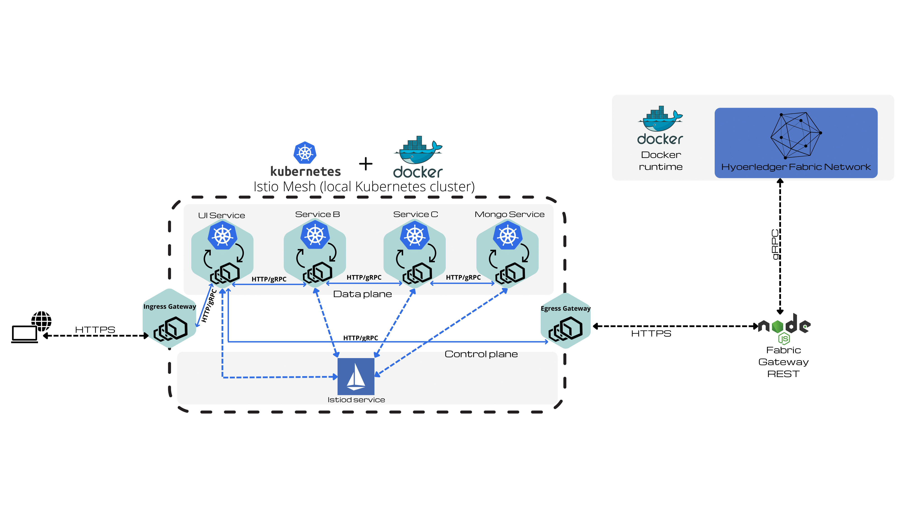

# fabric-data-privacy-thesis
This repository is composed of two submodules that pertain to the two applications developed as part of my bachelor's thesis concerning the implementation of an Istio service mesh and the implementation of a Smart Contract on a Hyperledger Fabric platform.

